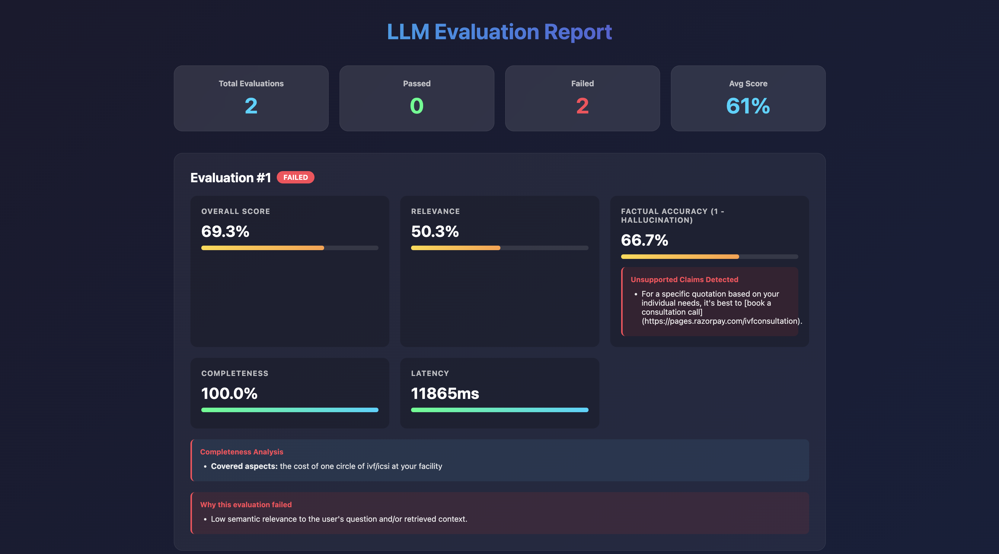
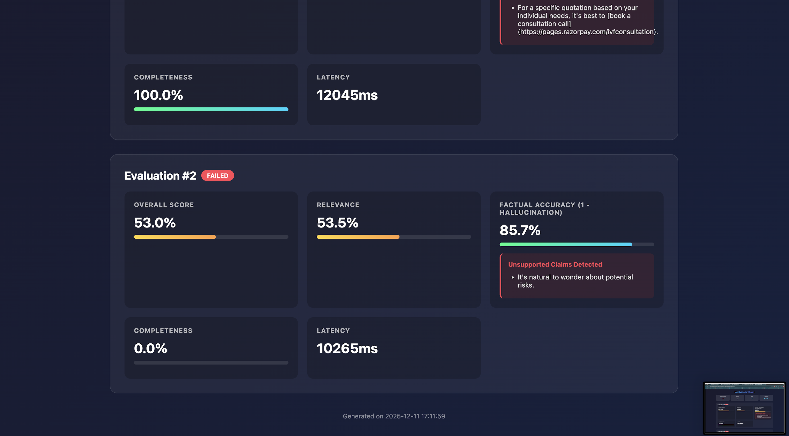

# LLM Response Evaluation Pipeline

A Python pipeline for evaluating LLM/chatbot responses in RAG (Retrieval-Augmented Generation) systems. Evaluates responses for **relevance**, **hallucination**, and **completeness** while tracking **latency** and **cost** metrics in real-time.

Built for the BeyondChats AI Internship Assignment.

---

## 🎯 Demo

### Visual Dashboard
The pipeline generates beautiful HTML reports for evaluation results: 




### Sample Output
```
Sample     Overall  Relevance   Halluc.   Complete    Status
#1         69.26%   50.28%      33.33%    100.00%     ❌ FAIL
#2         53.00%   53.47%      14.29%    0.00%       ❌ FAIL
```

---

## Table of Contents

- [Features](#features)
- [Architecture](#architecture)
- [Design Decisions](#design-decisions)
- [Scalability & Performance](#scalability--performance)
- [Benchmark Results](#benchmark-results)
- [Installation](#installation)
- [Usage](#usage)
- [Input/Output Format](#inputoutput-format)
- [Evaluation Metrics](#evaluation-metrics)
- [Running Tests](#running-tests)
- [Project Structure](#project-structure)

---

## Features

- **Relevance Evaluation**: Measures semantic similarity between response, query, and retrieved context
- **Hallucination Detection**: Identifies claims in responses not supported by the provided context
- **Completeness Checking (Semantic Coverage)**: Extracts key aspects from the user query using regex-based aspect mining, computes semantic similarity via sentence-transformers, combines it with keyword overlap, and determines whether each aspect was fully addressed.
- **Confidence Scoring**: Indicates how confident the system is in its evaluation
- **Latency Tracking**: Detailed timing breakdown for each evaluation stage
- **Cost Estimation**: Token counting and cost calculation for LLM operations
- **HTML Reports**: Beautiful visual dashboards for evaluation results
- **Benchmarking**: Performance testing for scalability verification
- **Flexible Input**: Supports BeyondChats JSON format and generic conversation/context formats
- **Real-time Ready**: Optimized for low-latency evaluation in production environments

---

### ✨ Advanced Features (New Additions)

**Explainability Layer**  
Generates human-readable explanations that describe *why* a response passed or failed.  
Includes:
- Evaluation reasoning summary  
- Metric-by-metric breakdown  
- Unsupported claim reporting  
- Confidence interpretation  

**Auto-Suggestions for Improvement**  
Provides actionable recommendations such as:
- Improving RAG retrieval  
- Adding more context vectors  
- Reducing unsupported claims  

**Enhanced CLI Output**  
Adds structured sections to command-line output:
- Explanation block  
- Detailed diagnostic breakdown  
- Suggested next steps  

**Historical Evaluation Memory (SQLite) — NEW**  
Automatically stores every evaluation run (demo, samples, custom files, stress tests) in a lightweight SQLite database.

Each entry logs:
- Overall score  
- Relevance, hallucination, completeness scores  
- Latency in milliseconds  
- Pass or fail status  
- Timestamp  
- Failure reason (automatically inferred)

View aggregated stats with:

```bash
python main.py --stats
```

**Last 20 Evaluations**
|-------------|------------|
| Avg Overall Score | 72.4% |
| Avg Relevance | 81.2% |
| Avg Hallucination | 11.2% |
| Avg Completeness | 91.5% |
| P95 Latency | 47.9 ms |
| Most Frequent Failure | Hallucination |

---

## Architecture

```
┌─────────────────────────────────────────────────────────────────┐
│                       EVALUATION PIPELINE                       │
├─────────────────────────────────────────────────────────────────┤
│                                                                 │
│              ┌──────────────┐    ┌──────────────┐               │
│              │ Conversation │    │   Context    │               │
│              │     JSON     │    │    JSON      │               │
│              └──────┬───────┘    └──────┬───────┘               │
│                     │                   │                       │
│                     ▼                   ▼                       │
│              ┌─────────────────────────────────────┐            │
│              │            INPUT PARSER             │            │
│              │  • Parse conversation_turns         │            │
│              │  • Extract vector_data              │            │
│              │  • Normalize roles & content        │            │
│              └─────────────────┬───────────────────┘            │
│                                │                                │
│                                ▼                                │
│              ┌─────────────────────────────────────┐            │
│              │          EVALUATION INPUT           │            │
│              │  • Last user message (query)        │            │
│              │  • Last AI response                 │            │
│              │  • Combined context                 │            │
│              └─────────────────┬───────────────────┘            │
│                                │                                │
│        ┌─────────────┬─────────┼─┬──────────────────┐           │
│        ▼             ▼           ▼                  ▼           │
│   ┌──────────┐ ┌──────────┐ ┌────────────┐   ┌──────────────┐   │
│   │RELEVANCE │ │COMPLETE  │ │HALLUCINATE │   │   LATENCY    │   │
│   │EVALUATOR │ │EVALUATOR │ │  DETECTOR  │   │   TRACKER    │   │
│   ├──────────┤ ├──────────┤ ├────────────┤   ├──────────────┤   │
│   │Sentence  │ │Aspect    │ │Claim       │   │Per-stage     │   │
│   │Embeddings│ │Extraction│ │Extraction  │   │timing        │   │
│   │Cosine    │ │Coverage  │ │Context     │   │              │   │
│   │Similarity│ │Check     │ │Verification│   │              │   │
│   └────┬─────┘ └─────┬────┘ └─────┬──────┘   └──────┬───────┘   │
│        │             │            │                 │           │
│        └─────────────┴────────────┴─────────────────┘           │
│                               │                                 │
│                               ▼                                 │
│                ┌─────────────────────────────┐                  │
│                │      RESULT AGGREGATOR      │                  │
│                │  • Overall score            │                  │
│                │  • Confidence score         │                  │
│                │  • Pass/Fail determination  │                  │
│                │  • Detailed breakdowns      │                  │
│                │  • Cost metrics             │                  │
│                └──────────────┬──────────────┘                  │
│                               │                                 │
│                               ▼                                 │
│                ┌─────────────────────────────┐                  │
│                │  JSON OUTPUT + HTML REPORT  │                  │
│                └─────────────────────────────┘                  │
└─────────────────────────────────────────────────────────────────┘
```

### Component Breakdown

| Component | Responsibility | Key Technology |
|-----------|---------------|----------------|
| **Input Parser** | Parse BeyondChats JSON format, normalize data | Python dict parsing |
| **Relevance Evaluator** | Semantic similarity scoring | sentence-transformers |
| **Hallucination Detector** | Claim extraction & verification | sentence-transformers |
| **Completeness Evaluator** | Query coverage analysis | Regex + embeddings |
| **Confidence Scorer** | Evaluation reliability assessment | Statistical analysis |
| **Latency Tracker** | Per-stage timing | Python time. perf_counter |
| **Cost Tracker** | Token counting & cost estimation | tiktoken |
| **Report Generator** | Visual HTML dashboards | HTML/CSS |

---

## Design Decisions

### Why This Approach?

#### 1. **Embedding-Based Similarity over LLM-as-Judge**

**Decision**: Use sentence-transformers (`all-MiniLM-L6-v2`) for semantic similarity instead of calling GPT/Claude to judge responses.

**Why**:
- **10-100x faster**: Embeddings compute in ~20ms vs 1-2s for LLM API calls
- **Near-zero marginal cost**: No per-evaluation API fees
- **No external dependencies**: Works offline, no API keys needed
- **Deterministic**: Same input always produces same output (important for testing)

**Trade-off**: Slightly less nuanced than LLM-as-Judge, but acceptable for real-time evaluation.

#### 2. **Claim-Based Hallucination Detection**

**Decision**: Extract individual claims from responses and verify each against context.

**Why**: 
- **Granular detection**: Identifies exactly which claims are unsupported
- **Actionable feedback**: "Claim X is not supported" vs "Response has hallucinations"
- **Debuggable**: Easy to trace why something was flagged

**Alternative considered**: Full NLI (Natural Language Inference) between response and context.  Rejected because it's computationally expensive and less interpretable.

#### 3. **Lazy Loading for Models**

**Decision**: Load ML models only when first needed, not at initialization.

```python
@property
def model(self) -> SentenceTransformer:
    if self._model is None:
        self._model = SentenceTransformer(self.config.embedding_model)
    return self._model
```

**Why**:
- **Faster startup**: Pipeline initializes instantly
- **Memory efficient**: Models loaded only if needed
- **Reusable**: Once loaded, cached for subsequent evaluations

#### 4. **Modular Architecture**

**Decision**: Separate evaluators for each metric, orchestrated by a central pipeline.

**Why**:
- **Testable**: Each component can be unit tested independently
- **Maintainable**: Easy to modify one evaluator without affecting others
- **Extensible**: Add new evaluation metrics by creating new evaluators
- **Configurable**: Enable/disable specific evaluations as needed

#### 5. **Weighted Overall Score**

**Formula**: `Relevance (35%) + (1 - Hallucination) (40%) + Completeness (25%)`

**Why this weighting**:
- **Hallucination (40%)**: Most critical - factual errors destroy trust
- **Relevance (35%)**: Important - irrelevant answers waste user time
- **Completeness (25%)**: Valuable but partial answers can still be useful


#### 6. **Confidence Scoring**

**Decision**: Add a confidence score to indicate evaluation reliability.

**Why**: 
- **Transparency**: Users know when to trust results
- **Edge case handling**: Borderline scores get flagged
- **Better decisions**: Low confidence = human review needed

---

## Scalability & Performance

### How We Handle Millions of Daily Conversations

#### 1. **Lightweight Models**

| Model | Size | Inference Time | Memory |
|-------|------|----------------|--------|
| all-MiniLM-L6-v2 | 80MB | ~20ms | ~200MB |

We use the **smallest effective model** for embeddings.  The MiniLM model achieves 90%+ of the quality of larger models at 1/20th the latency.

#### 2. **Embedding Caching**

```python
if self. config.cache_embeddings:
    cache_key = hash(text[: 500])
    if cache_key in self._embedding_cache:
        return self._embedding_cache[cache_key]
```

**Impact**: Repeated text (common greetings, standard responses) are computed once. 

#### 3. **Batch Processing Ready**

```python
def evaluate_batch(self, inputs: List[EvaluationInput]) -> List[EvaluationResult]:
    # Process multiple evaluations efficiently
```

For high throughput, batch multiple conversations together to maximize GPU utilization.

#### 4. **Lazy Evaluation**

Models are loaded on-demand, not at startup. In a microservice architecture: 
- Cold start:  ~3s (model loading)
- Warm evaluation: ~45ms

#### 5. **Cost Optimization Strategies**

| Strategy | Implementation | Savings |
|----------|---------------|---------|
| **Local Models** | No API calls for evaluation | ~$0.01-0.05 per evaluation |
| **Token Counting** | tiktoken (local) vs API tokenizer | 100% |
| **Caching** | Embedding cache for repeated text | 20-40% |
| **Early Exit** | Skip completeness if hallucination=100% | Variable |

#### 6. **Production Deployment Recommendations**

```yaml
# Kubernetes deployment for scale
apiVersion: apps/v1
kind: Deployment
spec:
  replicas: 10  # Scale based on load
  template:
    spec:
      containers:
      - name: evaluator
        resources:
          requests:
            memory: "512Mi"
            cpu: "500m"
          limits:
            memory: "2Gi"
            cpu: "2000m"
```

**Recommended Infrastructure**:
- **Load Balancer**: Distribute across multiple evaluator instances
- **Redis Cache**: Shared embedding cache across instances
- **GPU Nodes**: For high-throughput batch processing
- **Async Queue**: Kafka/RabbitMQ for non-blocking evaluation

---

## Benchmark Results

Actual performance measurements on MacBook Air (M1):

### Latency

| Metric | Value |
|--------|-------|
| **Mean** | 44.7ms |
| **Median** | 44.7ms |
| **Std Dev** | 1.4ms |
| **Min** | 41.7ms |
| **Max** | 46.8ms |
| **p95** | 46.8ms |

### Throughput (Single Instance)

| Metric | Value |
|--------|-------|
| **Per minute** | 1,341 evaluations |
| **Per day** | 1,931,374 evaluations |
| **For 1M/day** | 1 instance needed |

### Latency Breakdown By Stage (Actual Measurements)

From our test runs: 

| Stage | Time | % of Total |
|-------|------|------------|
| Relevance | ~10ms | 22% |
| Hallucination | ~25ms | 56% |
| Completeness | ~10ms | 22% |
| **Total** | ~45ms | 100% |

> **Note**: Benchmark uses simple test data. Real-world performance with larger contexts may vary.  Run `python benchmark.py` to test on your hardware.

---

## Installation

### Prerequisites
- Python 3.8+
- pip

### Local Setup

1. **Clone the repository**: 
```bash
git clone https://github.com/JustJay7/llm-evaluation-pipeline.git
cd llm-evaluation-pipeline
```

2. **Create a virtual environment** (recommended):
```bash
python -m venv venv
source venv/bin/activate  # On Windows: venv\Scripts\activate
```

3. **Install dependencies**:
```bash
pip install -r requirements.txt
```

4. **Verify installation**:
```bash
python main.py --demo
```

---

## Usage

### Quick Demo
Run the built-in demo with sample data:
```bash
python main.py --demo
```

### Evaluate Sample Files
Run evaluation on the BeyondChats sample files in the `data/` folder:
```bash
python main.py --samples
```

### Generate HTML Report
Run evaluation and generate a visual HTML report:
```bash
python main.py --samples --report
```
Then open `evaluation_report.html` in your browser.

### Run Benchmark
Test performance on your machine:
```bash
python benchmark.py
```

### Evaluate Custom Files
Provide your own conversation and context JSON files:
```bash
python main.py -c path/to/conversation.json -x path/to/context.json
```

Save results to a file:
```bash
python main.py -c conversation.json -x context.json -o results.json --report
```

### Programmatic Usage

```python
from evaluator. pipeline import EvaluationPipeline
from evaluator.confidence import calculate_confidence

# Initialize pipeline
pipeline = EvaluationPipeline()

# Prepare input data (BeyondChats format)
conversation_json = {
    "conversation_turns": [
        {"role": "User", "message": "What is IVF?"},
        {"role":  "AI/Chatbot", "message": "IVF is in vitro fertilization... "}
    ]
}

context_json = {
    "data":  {
        "vector_data": [
            {"text": "IVF (In Vitro Fertilization) is a medical procedure..."}
        ]
    }
}

# Run evaluation
result = pipeline.evaluate_from_json(conversation_json, context_json)

# Access results
print(f"Overall Score: {result.overall_score}")
print(f"Passed: {result.passed}")
print(f"Confidence:  {calculate_confidence(result):. 1%}")
print(f"Hallucination Score: {result.hallucination. score}")
print(f"Unsupported Claims: {result.hallucination.unsupported_claims}")

# Export to JSON
result_dict = result.to_dict()

# Generate HTML report
from evaluator.report import generate_html_report
generate_html_report([result_dict], "my_report.html")
```

---

## Input/Output Format

### Input:  Conversation JSON (BeyondChats Format)
```json
{
    "chat_id": 12345,
    "conversation_turns": [
        {
            "turn":  1,
            "role": "User",
            "message": "What is the cost of IVF? ",
            "created_at": "2025-01-01T10:00:00.000000Z"
        },
        {
            "turn": 2,
            "role": "AI/Chatbot",
            "message": "The cost of IVF at our clinic is.. .",
            "created_at":  "2025-01-01T10:00:05.000000Z"
        }
    ]
}
```

### Input: Context JSON (BeyondChats Format)
```json
{
    "status": "success",
    "data": {
        "vector_data": [
            {
                "id": 123,
                "text": "IVF treatment costs approximately.. .",
                "source_url": "https://example.com/ivf-costs",
                "tokens": 150
            }
        ]
    }
}
```

### Output: Evaluation Result
```json
{
    "overall_score": 0.85,
    "passed": true,
    "timestamp": "2025-01-01T12:00:00.000000",
    "relevance":  {
        "score": 0.82,
        "is_relevant": true,
        "query_response_similarity": 0.75,
        "context_response_similarity": 0.88
    },
    "hallucination": {
        "score":  0.1,
        "is_hallucinated": false,
        "unsupported_claims": [],
        "supported_claims_count": 5
    },
    "completeness": {
        "score": 1.0,
        "is_complete": true,
        "covered_aspects": ["cost of ivf treatment"],
        "missing_aspects": []
    },
    "latency": {
        "total_ms": 45.5,
        "relevance_ms": 10.2,
        "hallucination_ms": 25.1,
        "completeness_ms": 10.2
    },
    "cost":  {
        "input_tokens": 500,
        "output_tokens":  100,
        "total_tokens":  600,
        "estimated_cost_usd": 0.001
    }
}
```

### Sample Evaluation Results

From running on BeyondChats sample data:

| Sample | Overall | Relevance | Hallucination | Completeness | Status |
|--------|---------|-----------|---------------|--------------|--------|
| #1 (IVF Cost) | 69.3% | 50. 3% | 33.3% | 100.0% | ❌ FAIL |
| #2 (Donor Egg) | 53.0% | 53.5% | 14.3% | 0.0% | ❌ FAIL |

**Key Findings**:
- Sample #1: Caught unsupported marketing claim (consultation booking link)
- Sample #2: Detected incomplete response to user's question about donor eggs

---

## Evaluation Metrics

### Relevance Score (0-1)
Measures how well the response relates to both the user query and retrieved context. 

- **Method**: Sentence embeddings + cosine similarity
- **Formula**: `0.4 × query_similarity + 0.6 × context_similarity`
- **Threshold**: 0.6 (configurable)

### Hallucination Score (0-1)
Detects unsupported claims by checking each statement against the context.

- **Method**: Claim extraction → semantic matching against context
- **0.0** = No hallucination (all claims supported)
- **1.0** = Complete hallucination (no claims supported)
- **Threshold**: 0.5 (above = hallucinated)

### Completeness Score (0-1)
Evaluates whether key aspects of the question are addressed.

- **Method**: Query aspect extraction → coverage verification
- **1.0** = All aspects covered
- **0.0** = No aspects covered

### Confidence Score (0-1)
Indicates how reliable the evaluation results are.

- **Method**: Statistical analysis of score distributions
- **Factors that reduce confidence**:
  - Borderline scores (near thresholds)
  - Few claims to verify
  - Ambiguous queries
- **Usage**: Low confidence → consider human review

### Overall Score
```
overall = 0.35 × relevance + 0.40 × (1 - hallucination) + 0.25 × completeness
```

### Pass/Fail Criteria
- Overall score ≥ 0.7
- No critical hallucinations (hallucination score < 0.5)
- Minimum relevance (relevance score ≥ 0.6)

---

## Running Tests

```bash
# Run all tests
python -m unittest tests.test_pipeline -v

# Run specific test class
python -m unittest tests.test_pipeline.TestHallucinationDetector -v
```

---

## Project Structure

```
llm-evaluation-pipeline/
├── evaluator/
│   ├── __init__.py          # Package exports
│   ├── config.py            # Configuration management
│   ├── models.py            # Data models (dataclasses)
│   ├── utils.py             # Text processing, timing utilities
│   ├── relevance.py         # Relevance & completeness evaluators
│   ├── hallucination.py     # Hallucination detection
│   ├── cost_tracker.py      # Cost and latency tracking
│   └── pipeline.py          # Main orchestration pipeline
│   ├── confidence.py        # Confidence scoring
│   └── report.py            # HTML report generation
├── tests/
│   ├── __init__.py
│   └── test_pipeline.py     # Comprehensive unit tests
├── data/
│   ├── sample-chat-conversation-01.json
│   ├── sample-chat-conversation-02.json
│   ├── sample_context_vectors-01.json
│   └── sample_context_vectors-02.json
├── docs/
│   ├── report-screenshot-1.png  # Dashboard screenshot
│   └── report-screenshot-2.png  # Dashboard screenshot
├── main.py                  # CLI entry point
├── benchmark.py             # Performance benchmarking
├── requirements.txt         # Python dependencies
└── README.md                # This file
```

---

## Configuration

Environment variables for customization:

| Variable | Default | Description |
|----------|---------|-------------|
| `EVAL_EMBEDDING_MODEL` | `all-MiniLM-L6-v2` | Sentence transformer model |
| `EVAL_RELEVANCE_THRESHOLD` | `0.6` | Minimum relevance score |
| `EVAL_HALLUCINATION_THRESHOLD` | `0.5` | Maximum hallucination score |
| `EVAL_INPUT_TOKEN_COST` | `0.0015` | Cost per 1K input tokens |
| `EVAL_OUTPUT_TOKEN_COST` | `0.002` | Cost per 1K output tokens |

---

## Future Improvements

1. **GPU Acceleration**: Add CUDA support for batch processing
2. **Async Evaluation**: Non-blocking evaluation for real-time systems
3. **Custom Thresholds**: Per-domain threshold configuration
4. **Explanation Generation**: Human-readable explanations for failures
5. **Dashboard**: Real-time monitoring visualization
6. **A/B Testing**: Compare different LLM configurations
7. **Multi-language Support**: Evaluate responses in different languages

---

## Technologies Used

- **sentence-transformers**: Semantic similarity with pre-trained models
- **scikit-learn**: Cosine similarity calculations
- **tiktoken**: Token counting for cost estimation
- **NumPy**: Numerical operations

---

## Author

**JustJay7** - BeyondChats AI Internship Assignment

---

## License

MIT License